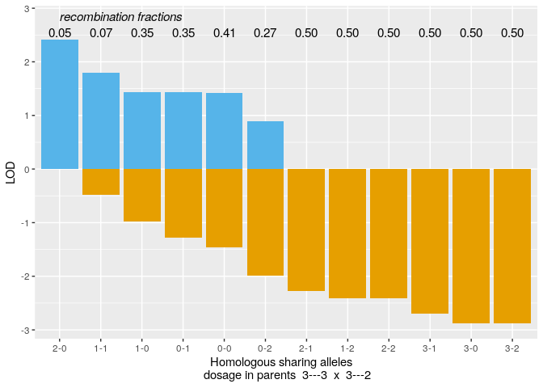
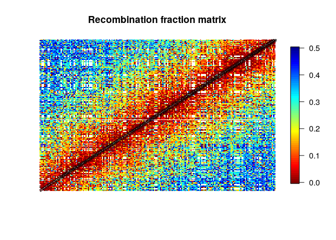
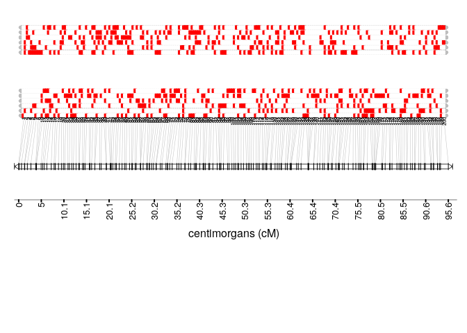
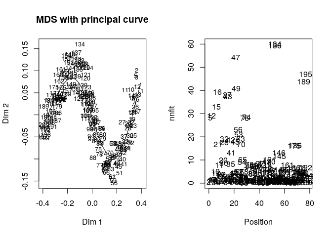
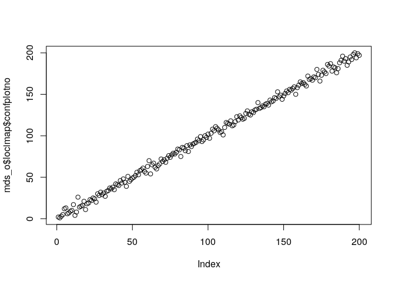
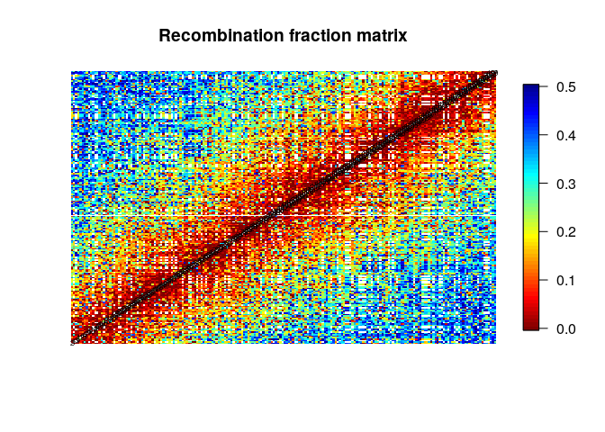
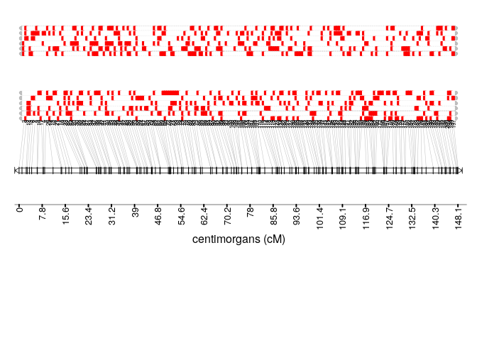
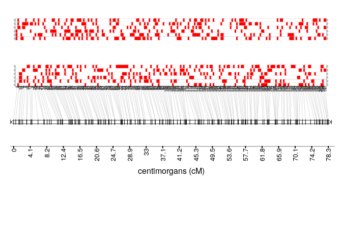

Introduction
------------

**NOTE** `mappoly` is under development. This is preliminary version of `mappoly`.

`mappoly` is a package to construct genetic maps in autopolyploids with even ploidy levels. In its current version, `mappoly` can handle ploidy levels up to 8, when using hidden Markov models (HMM), and up to 12, when using the two-point simplification. All the two-point based functions are fast enough to run on standard computers, but we strongly recommend to use high-performance computation, especially for ploidy levels higher than 4.

Here we assume that the genotypic data is available and in the format required by `mappoly`. In a future version, this document will include instructions about genotype calling. The primary purpose of this tutorial is to show some functions available in `mappoly`.

`mappoly` is not available in CRAN, but you can install it from Git Hub

Within R, you need to install and load the package `devtools`:

``` r
install.packages("devtools")
```

To install `mappoly` from Git Hub

``` r
devtools::install_github("mmollina/mappoly")
```

Mapping analysis (simulated hexaploid data)
-------------------------------------------

### Simulation

First, we need to simulate a linkage phase configuration in both parents. We can do that using

``` r
require(mappoly)
```

    ## Loading required package: mappoly

``` r
ph.temp<-sim_homologous(m = 6,                          # ploidy level
                        n.mrk = 200,                    # number of markers 
                        max.d = 3,                      # maximum dosage number
                        choose.hom.at.random = TRUE,    # allelic variants randomly attributed to homologous
                        seed = 3141593)                 # simulation seed
names(ph.temp$hom.allele.p)<-names(ph.temp$hom.allele.q)<-1:200
```

Now, let us simulate a full-sib mapping population. Here, the inter-marker distance is 0.5 centimorgans, and the population has 300 individuals.

``` r
#Recombination fraction vector
rf.vec<-rep(mf_h(0.5), 199)

#dummy simulation just to cache genotype counts
dat <- poly_cross_simulate(m = 6,
                           rf.vec = rf.vec,
                           n.mrk = 200,
                           n.ind = 300,
                           hom.allele = ph.temp)
dat
```

    ## This is an object of class 'mappoly.data'
    ##     Ploidy level:    6 
    ##     No. individuals:    300 
    ##     No. markers:        200 
    ## 
    ##     No. markers per sequence: not available
    ##     ----------
    ##     No. of markers per dosage in both parents:
    ##     dP dQ freq
    ##      0  1   17
    ##      0  2   15
    ##      0  3   12
    ##      1  0    9
    ##      1  1   15
    ##      1  2    9
    ##      1  3   12
    ##      2  0   13
    ##      2  1   11
    ##      2  2   11
    ##      2  3   14
    ##      3  0   15
    ##      3  1   20
    ##      3  2   16
    ##      3  3   11

The program prints a summary of the simulated data. The first step when constructing a genetic map is to perform the two-point analysis. To select all markers, we need to use function `make_seq_mappoly` with `arg = 'all'`. The argument `'all'` tells `mappoly` to select all markers available in the dataset. It is also possible to load data only for a specific sequence provided along with the dataset using `arg = 'seqx'`, where `x` is the number of the sequence. Is possible to load specific markers using a vector of numbers which indicates the positions of the markers in the dataset.

``` r
all_snp<-make_seq_mappoly(input.obj = dat, arg = 'all')
all_snp
```

    ## This is an object of class 'mappoly.sequence'
    ##     ------------------------
    ##     Parameters not estimated
    ##     ------------------------
    ##     Ploidy level:    6 
    ##     No. individuals:    300 
    ##     No. markers:        200 
    ## 
    ##     No. markers per sequence: not available
    ##     ----------
    ##     No. of markers per dosage in both parents:
    ##     dP dQ freq
    ##      0  1   17
    ##      0  2   15
    ##      0  3   12
    ##      1  0    9
    ##      1  1   15
    ##      1  2    9
    ##      1  3   12
    ##      2  0   13
    ##      2  1   11
    ##      2  2   11
    ##      2  3   14
    ##      3  0   15
    ##      3  1   20
    ##      3  2   16
    ##      3  3   11

Now, let us load all the
*ζ*<sub>T<sub>*k*</sub>, T<sub>*k*<sup>′</sup></sub></sub>(*l*<sub>*P*</sub>, *l*<sub>*Q*</sub>)
 defined in equation 20 in [Mollinari and Garcia 2018](doi). This object is fundamental to perform the dimension reduction of the transition space.

``` r
counts<-cache_counts_twopt(input.seq = all_snp, get.from.web = TRUE)
```

    ## Internet conectivety ok.
    ## Loading genotype counts from web

``` r
counts
```

    ##   This is an object of class 'cache.info'
    ##   -----------------------------------------------------
    ##   Ploidy level:                                6 
    ##   No. marker combinations:                     2401 
    ##   -----------------------------------------------------

The function `est_pairwise_rf` estimates all the pairwise recombination fractions in the sequence. Since the output object is to big, `mappoly` shows only a summary. Notice that parallel computation is available.

``` r
all_rf_pairwise <- est_pairwise_rf(input.seq = all_snp, 
                                   count.cache = counts, 
                                   n.clusters = 16)
```

    ## INFO: Using  16  CPUs for calculation.
    ## INFO: Done with 19900  pairs of markers 
    ## INFO: Calculation took: 15.736 seconds

``` r
all_rf_pairwise
```

    ##   This is an object of class 'poly.est.two.pts.pairwise'
    ##   -----------------------------------------------------
    ##   No. markers:                             200 
    ##   No. estimated recombination fractions:   18272 (91.8%)
    ##   -----------------------------------------------------

If one wants to access a particular pair of markers, it is possible to use

``` r
all_rf_pairwise$pairwise$`40-51`
```

    ##         LOD_ph         rf       LOD_rf
    ## 2-0  0.0000000 0.04882937 2.4156904104
    ## 1-1 -0.4799869 0.07270805 1.8018361897
    ## 1-0 -0.9788092 0.35091333 1.4368811664
    ## 0-1 -1.2728858 0.34943408 1.4301924616
    ## 0-0 -1.4656863 0.40936603 1.4148360754
    ## 0-2 -1.9822153 0.26964917 0.8983071317
    ## 2-1 -2.2821159 0.49995416 0.0002927886
    ## 1-2 -2.4159914 0.49995416 0.0003010082
    ## 2-2 -2.4165569 0.49995416 0.0008665152
    ## 3-1 -2.7039333 0.49995416 0.0008550938
    ## 3-0 -2.8808077 0.49995416 0.0002852541
    ## 3-2 -2.8820692 0.49994985 0.0015467586

``` r
plot(all_rf_pairwise, first.mrk = 40, second.mrk = 51)
```



In this case, `40-51` represents the number (position) of the markers in the original dataset. In the output, the name of the rows is of the form `x-y`, where `x` indicates how many homologous chromosomes share the same allelic variant in parent *P* and `y` in parent *Q* (see [Mollinari and Garcia 2018](doi) for notation). The first column indicates the LOD Score in relation to the most likely linkage phase configuration. The second column shows the recombination fraction, and the third indicates the LOD Score comparing the likelihood under no linkage (*r* = 0.5) and the estimated recombination fraction (evidence of linkage). In the next step, the two-point object should be converted into recombination fraction and LOD Score matrices. To select the recombination fractions for each one of the SNP combinations, one needs to assume thresholds for the three columns observed in the previous output. The arguments `thresh.LOD.ph` and `thresh.LOD.rf` set LOD Scores thresholds for the second most likely linkage phase configuration and recombination fraction. In this case `thresh.LOD.ph = 0` and `thresh.LOD.rf = 0`, thus no matter how likely is the second best option, all the computed values will be considered. The argument `thresh.rf = 0.5` indicates that the maximum accepted recombination fraction is `0.5`. To convert these values in a recombination fraction matrix, we use the function `rf_list_to_matrix`

``` r
mat <- rf_list_to_matrix(input.twopt = all_rf_pairwise, n.clusters = 16)
```

    ## INFO: Using  16  CPUs.
    ## INFO: Done with 19900  pairs of markers 
    ## INFO: Operation took: 5.991 seconds

``` r
plot(mat)
```



In the previous case, the thresholds allowed to show almost all points on the recombination fraction matrix. If these values become more stringent (LOD higher and lower rf), the result becomes more sparse. It is also important to notice that since the reference genome of potato is publicly available, the dataset was already ordered using this reference and it is possible to see a clear block diagonal pattern on the recombination fraction matrix. Also, within each matrix, it is possible to observe a monotonicity pattern.

### Estimating the map for a given order

Let us estimate the map (recombination fraction and linkage phase) for this given order. (Preferably, use high-performance computing for this function.)

``` r
map_given_ord<-est_rf_hmm_sequential(input.seq = all_snp,
                                     thres.twopt = 3,
                                     thres.hmm = 10,
                                     extend.tail = 50,
                                     twopt = all_rf_pairwise,
                                     tol = 0.1, 
                                     tol.final = 10e-4, 
                                     verbose = TRUE, 
                                     rf.lim = .1, 
                                     phase.number.limit = 60, 
                                     info.tail = TRUE,               
                                     reestimate.single.ph.configuration = FALSE)
```

    ## Number of markers : 200 
    ## ----------------------------------------
    ## (1): 1   - M_1
    ## (2): 2   - M_2   --> 0
    ## (3): 3   - M_3   --> 1 ph(s) / 0.20(0.1) tail: 3
    ## (4): 4   - M_4   --> 1 ph(s) / 0.10(0.1) tail: 4
    ## (5): 5   - M_5   --> 1 ph(s) / 0.10(0.1) tail: 5
    ## (6): 6   - M_6   --> 4 ph(s) / 0.60(0.1) tail: 6
    ## (7): 7   - M_7   --> 1 ph(s) / -0.40(0.1) tail: 7
    ## (8): 8   - M_8   --> 1 ph(s) / 0.10(0.1) tail: 8
    ## (9): 9   - M_9   --> 1 ph(s) / 0.10(0.1) tail: 9
    .
    .
    .
    ## (190):   190 - M_190 --> 1 ph(s) / 0.00(0.1) tail: 51
    ## (191):   191 - M_191 --> 1 ph(s) / 0.00(0.1) tail: 51
    ## (192):   192 - M_192 --> 1 ph(s) / 0.00(0.1) tail: 51
    ## (193):   193 - M_193 --> 1 ph(s) / 0.00(0.1) tail: 51
    ## (194):   194 - M_194 --> 1 ph(s) / 0.00(0.1) tail: 51
    ## (195):   195 - M_195 --> 1 ph(s) / 0.00(0.1) tail: 51
    ## (196):   196 - M_196 --> 1 ph(s) / 0.00(0.1) tail: 51
    ## (197):   197 - M_197 --> 1 ph(s) / 0.00(0.1) tail: 51
    ## (198):   198 - M_198 --> 1 ph(s) / 0.00(0.1) tail: 51
    ## (199):   199 - M_199 --> 1 ph(s) / 0.00(0.1) tail: 51
    ## (200):   200 - M_200 --> 1 ph(s) / 0.00(0.1) tail: 51
    ## Number of linkage phase configurations:  1
    ## ---------------------------------------------
    ## 1 phase(s): 1

``` r
map_given_ord
```

    ## This is an object of class 'mappoly.map'
    ##     Ploidy level:     6 
    ##     No. individuals:  300 
    ##     No. markers:  200 
    ##     No. linkage phases:   1 
    ## 
    ##     ---------------------------------------------
    ##     Linkage phase configuration:  1
    ##        log-likelihood:    -11713.53
    ##        LOD:       0
    ## 
    ##       M_1     | | | | | |         o | | | | |       0.0 
    ##       M_2     o o o | | |         | o | | | |       0.1 
    ##       M_3     | | | o o o         | | | | | |       0.6 
    ##       M_4     o | | o | |         | | | | | |       1.3 
    ##       M_5     o o o | | |         | o | | | |       1.3 
    ##       M_6     o o | | o |         | | o | | |       1.9 
    ##       M_7     o o | | | |         o | o | | |       2.7 
    ##       M_8     o | | | | |         | | | | | |       3.8 
    ##       M_9     o | o | | |         | | | | | |       3.9 
    .
    .
    .
    ##       M_190   | | | | o |         | o | | o o      90.3 
    ##       M_191   | o | | | |         | o | | | o      90.5 
    ##       M_192   o | o o | |         | | | | | |      91.7 
    ##       M_193   | | | | o |         | | | | o o      91.9 
    ##       M_194   | | | | | |         | o o | o |      92.3 
    ##       M_195   | | o | o |         | | | | | o      92.3 
    ##       M_196   o o | o | |         | | | o | |      93.2 
    ##       M_197   | o o | o |         | | o | | |      93.2 
    ##       M_198   | o | | | o         | | | | | |      93.7 
    ##       M_199   | | | | | o         o o | | o |      93.9 
    ##       M_200   | | o | | o         | | | | | |      95.6 
    ## 

``` r
h1.given.P <- map_given_ord$maps[[1]]$seq.ph$P
h2.given.P <- ph.temp$hom.allele.p[names(h1.given.P)]
compare_haplotypes(m = 6,  h1.given.P, h2.given.P) ## Comparing phased haplotypes
```

    ## $is.same.haplo
    ## [1] TRUE
    ## 
    ## $haplo.ord
    ## [1] 6 2 5 4 3 1

``` r
h1.given.Q <- map_given_ord$maps[[1]]$seq.ph$Q
h2.given.Q <- ph.temp$hom.allele.q[names(h1.given.Q)]
compare_haplotypes(m = 6,  h1.given.Q, h2.given.Q) ## Comparing phased haplotypes
```

    ## $is.same.haplo
    ## [1] TRUE
    ## 
    ## $haplo.ord
    ## [1] 3 5 6 2 4 1

``` r
plot(map_given_ord)
```



### Ordering markers

Given the recombination fraction matrix, it is possible to use two-point procedures to order the markers. Here we use the MDS (multidimensional scaling) algorithm, proposed by Preedy and Hackett (2016).

``` r
mds_o<-mds_mappoly(input.mat = mat)
```

    ## Stress: 0.382611721508471
    ## Nearest Neighbour Fit: 1267.55282149142
    ## Mean Nearest Neighbour Fit: 6.33776410745711

``` r
plot(mds_o)
```



``` r
plot(mds_o$locimap$confplotno)
```



``` r
plot(mat, ord = mds_o$locimap$confplotno)
```

 Reconstructing genetic map:

``` r
all_snp_mds<-make_seq_mappoly(input.obj = mds_o)
all_snp_mds
```

    ## This is an object of class 'mappoly.sequence'
    ##     ------------------------
    ##     Parameters not estimated
    ##     ------------------------
    ##     Ploidy level:    6 
    ##     No. individuals:    300 
    ##     No. markers:        200 
    ## 
    ##     No. markers per sequence: not available
    ##     ----------
    ##     No. of markers per dosage in both parents:
    ##     dP dQ freq
    ##      0  1   17
    ##      0  2   15
    ##      0  3   12
    ##      1  0    9
    ##      1  1   15
    ##      1  2    9
    ##      1  3   12
    ##      2  0   13
    ##      2  1   11
    ##      2  2   11
    ##      2  3   14
    ##      3  0   15
    ##      3  1   20
    ##      3  2   16
    ##      3  3   11

``` r
map_mds_ord<-est_rf_hmm_sequential(input.seq = all_snp_mds,
                                     thres.twopt = 5,
                                     thres.hmm = 5,
                                     extend.tail = 50,
                                     twopt = all_rf_pairwise,
                                     tol = 0.1, 
                                     tol.final = 10e-4, 
                                     verbose = TRUE, 
                                     phase.number.limit = 60)
```

    ## Number of markers : 200 
    ## ----------------------------------------
    ## (1): 1   - M_1
    ## (2): 3   - M_3   --> 
    ## -------
    ## marker ( 1 ) M_1  was not included.
    ## -------
    ## (1): 3   - M_3
    ## (2): 5   - M_5   --> 0.4
    ## (5): 12  - M_12  --> 4 ph(s) / 0.40(0.2) tail: 3
    ## (6): 13  - M_13  --> 2 ph(s) / 0.50(0.3) tail: 4
    ## (7): 6   - M_6   --> 12 ph(s) / 0.40(0.2) tail: 5
    ## (8): 7   - M_7   --> 1 ph(s) / 0.30(0.2) tail: 6
    ## (9): 9   - M_9   --> 2 ph(s) / 0.80(0.2) tail: 7
    .
    .
    .
    ## (190):   190 - M_190 --> 1 ph(s) / 0.60(0.3) tail: 51
    ## (191):   193 - M_193 --> 1 ph(s) / -0.70(0.6) tail: 51
    ## (192):   185 - M_185 --> 1 ph(s) / 0.50(0.2) tail: 51
    ## (193):   189 - M_189 --> 1 ph(s) / 0.50(0.3) tail: 51
    ## (194):   195 - M_195 --> 1 ph(s) / -0.60(0.3) tail: 51
    ## (195):   192 - M_192 --> 1 ph(s) / 0.10(0.3) tail: 51
    ## (196):   198 - M_198 --> 1 ph(s) / 0.20(0.3) tail: 51
    ## (197):   200 - M_200 --> 1 ph(s) / 0.40(0.3) tail: 51
    ## (198):   194 - M_194 --> 1 ph(s) / 0.20(0.1) tail: 51
    ## (199):   199 - M_199 --> 1 ph(s) / 0.30(0.3) tail: 51
    ## (200):   197 - M_197 --> 1 ph(s) / -1.40(0.2) tail: 51
    ## Number of linkage phase configurations:  1
    ## ---------------------------------------------
    ## 1 phase(s): 1

``` r
map_mds_ord
```

    ## This is an object of class 'mappoly.map'
    ##     Ploidy level:     6 
    ##     No. individuals:  300 
    ##     No. markers:  198 
    ##     No. linkage phases:   1 
    ## 
    ##     ---------------------------------------------
    ##     Linkage phase configuration:  1
    ##        log-likelihood:    -15620.42
    ##        LOD:       0
    ## 
    ##       M_3     o o o | | |         | | | | | |        0 
    ##       M_5     | | | o o o         o | | | | |        1 
    ##       M_12    | | | o | |         | o o o | |        2 
    ##       M_13    o o | | | |         | o o o | |        3 
    ##       M_6     o | | o o |         | | | | o |        4 
    ##       M_7     | | | o o |         | o | | o |        4 
    ##       M_9     | | | | o o         | | | | | |        6 
    ##       M_10    | | | | o |         | o o | | o        6 
    ##       M_17    | | | | | |         o | | | | o        8 
    ##       M_4     | | o | o |         | | | | | |        8 
    ##       M_8     | | | | o |         | | | | | |        9 
    .
    .
    .
    ##       M_190   o | | | | |         o | | o | o      143 
    ##       M_193   o | | | | |         | | | o | o      144 
    ##       M_185   | | | | | |         | o | | | |      144 
    ##       M_189   | | | | o o         o o | | | |      144 
    ##       M_195   o | | | | o         | | | o | |      145 
    ##       M_192   | | o | o o         | | | | | |      146 
    ##       M_198   | o | o | |         | | | | | |      147 
    ##       M_200   | o | | | o         | | | | | |      148 
    ##       M_194   | | | | | |         o | | | o o      148 
    ##       M_199   | o | | | |         o o | | | o      148 
    ##       M_197   o | | o | o         | | | | o |      148 
    ## 

``` r
h1.mds.P <- map_mds_ord$maps[[1]]$seq.ph$P
h2.mds.P <- ph.temp$hom.allele.p[names(h1.mds.P)]
compare_haplotypes(m = 6,  h1.mds.P, h2.mds.P) ## Comparing phased haplotypes
```

    ## $is.same.haplo
    ## [1] TRUE
    ## 
    ## $haplo.ord
    ## [1] 3 1 4 2 6 5

``` r
h1.mds.Q <- map_mds_ord$maps[[1]]$seq.ph$Q
h2.mds.Q <- ph.temp$hom.allele.q[names(h1.mds.Q)]
compare_haplotypes(m = 6,  h1.mds.Q, h2.mds.Q) ## Comparing phased haplotypes
```

    ## $is.same.haplo
    ## [1] TRUE
    ## 
    ## $haplo.ord
    ## [1] 5 3 2 1 6 4

``` r
plot(map_mds_ord)
```



Due to local misplacement, the HMM based map is quite long. Thus, in these cases, we use the weighted ordinary least squares to reestimate the final map.

``` r
map_mds_ord_ols <- reest_map(map_mds_ord, mat, method = "ols")
plot(map_mds_ord_ols)
```


