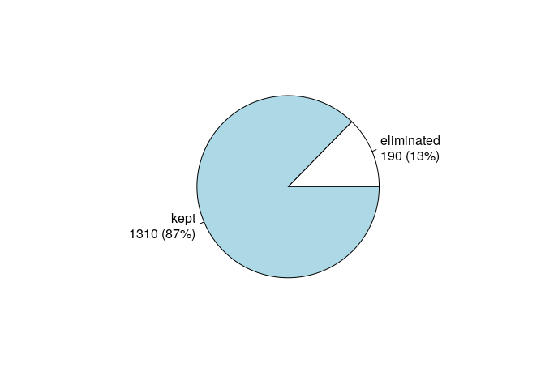
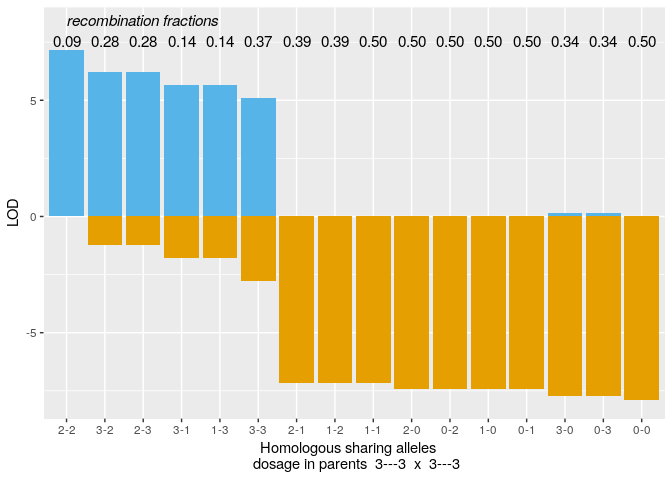
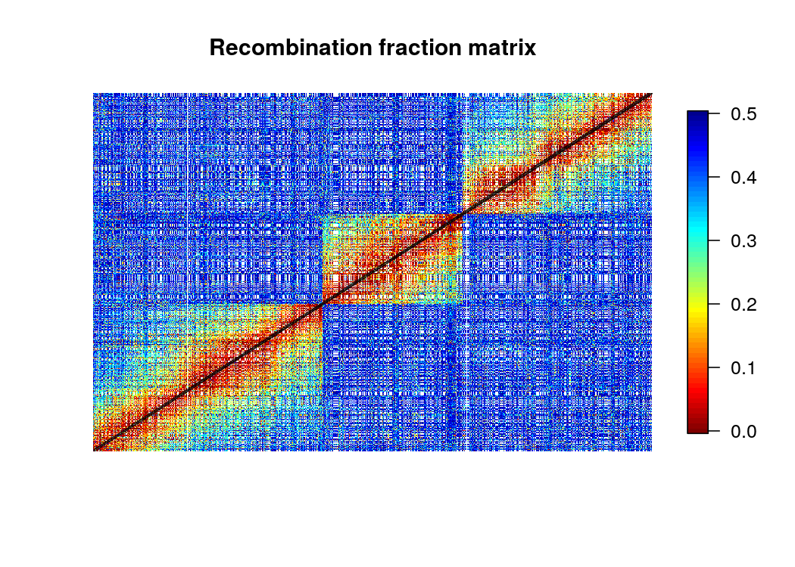
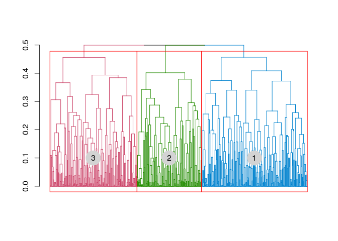
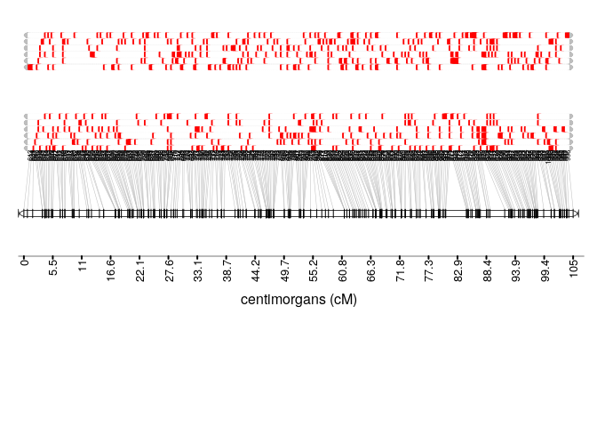
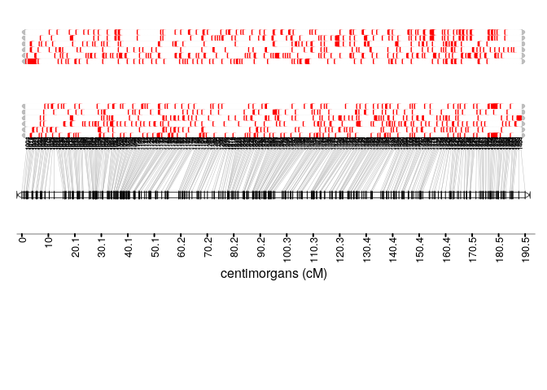

# Introduction

`mappoly` (v. 0.1.0) is an under development R package to construct genetic maps in autopolyploids with even ploidy levels. In its current version, `mappoly` can handle ploidy levels up to 8 when using hidden Markov models (HMM), and up to 12 when using the two-point simplification. All the two-point based functions are fast enough to run on standard computers. However, we strongly recommend to use high-performance computation for HMM-based analysis, especially for ploidy levels higher than 4. 

Here we assume that the genotypic data is available and in the format required by `mappoly`. In a future version, this document will include instructions about genotype calling and `vcf` files. The primary purpose of this tutorial is to show some functions available in `mappoly` and how to use them in as sequential fashion to construct a genetic map. The derivation of the HMM used in `mappoly` can be found in [@Mollinari2018](https://doi.org/10.1101/415232 ).

`mappoly` is not available in CRAN, but you can install it from Git Hub. Within R, you need to install and load the package `devtools`:

```R
install.packages("devtools")
```
To install `mappoly` from Git Hub use

```R
devtools::install_github("mmollina/mappoly")
```

# Loading `mappoly`

To load `mappoly`, simply type 


```r
library(mappoly)
```

# `hexafake` data set

In this tutorial, we use a simulated data set to guide the user though the basic steps of a genetic map construction using the functions available in `mappoly`. The simulated data set is distributed with `mappoly` and can be loaded using


```r
data("hexafake")
```

The `hexafake` data set contains 1500 markers distributed in three linkage groups and scored in a full-sib autohexaploid population containing 300 individuals. We denote the parents of this population $P$ and $Q$. The parental linkage phase and the recombination fraction used to simulate the population can be found in `inst\doc\` folder, also distributed with `mappoly`. To inspect the data set, we just type


```r
hexafake
```

```
## This is an object of class 'mappoly.data'
##     Ploidy level:    6 
##     No. individuals:    300 
##     No. markers:        1500 
## 
##     This dataset contains sequence information.
##     ----------
##     No. of markers per dosage in both parents:
##     dP dQ freq
##      0  1  361
##      0  2   83
##      0  3   19
##      0  4    5
##      0  5    1
##      1  0  394
##      1  1  147
##      1  2   67
##      1  3   20
##      1  4    6
##      1  5    3
##      2  0  107
##      2  1   66
##      2  2   54
##      2  3   40
##      2  4    9
##      3  0   22
##      3  1   24
##      3  2   26
##      3  3   16
##      4  0    3
##      4  1   14
##      4  2   10
##      5  0    2
##      5  1    1
```

The program prints a summary of the data set showing the ploidy level, the number of individuals and the number of markers. Also it prints the frequency of the possible markers dosage combination in both parents. A graphical representation of the frequencies can be obtained using


```r
plot(hexafake)
```

<!-- -->

The numbers separated by a dash indicate the dose in parents $P$ and $Q$ respectively. 

At this point, we need to select the set of markers we want to perform the analysis. To select all markers in the data set, we use the function `make_seq_mappoly` with `arg = 'all'`. It is also possible to load data only for a specific sequence using `arg = 'seqx'`, where `x` is the number of the sequence, provided in the input file. This feature can be useful in cases where the information about chromosomes or scaffold is available. It is also possible to load specific markers using a vector of numbers indicating the positions of the markers in the data set. Here, we select all markers


```r
all.mrk<-make_seq_mappoly(input.obj = hexafake, arg = 'all')
```

In real data sets, closely linked markers can carry exactly the same information about a specific genomic region and can be excluded from the analysis without modifying the results. To identify those markers we use


```r
filt.mrk<-elim_redundant(input.seq = all.mrk)
new.seq<-make_seq_mappoly(filt.mrk)
```
In this case, we could eliminate 190 markers (13%) from the 1500 available.


```r
plot(filt.mrk)
```

<!-- -->

# Two-point analysis

Once the markers where selected, wee need to compute the pairwise recombination fraction between all selected markers (two-point analysis). First, let us load the genotype counts ($\zeta_{\mbox{T}_{k},\mbox{T}_{k^{\prime}}}(l_{P}, l_{Q})$) defined in equation 20 in [@Mollinari2018](https://doi.org/10.1101/415232 ). This object is fundamental to perform the dimension reduction of the transition space.


```r
counts<-cache_counts_twopt(input.seq = new.seq, get.from.web = TRUE)
```

```
## Internet conectivety ok.
## Loading genotype counts from web
```

```r
counts
```

```
##   This is an object of class 'cache.info'
##   -----------------------------------------------------
##   Ploidy level:                                6 
##   No. marker combinations:                     2401 
##   -----------------------------------------------------
```

The function `est_pairwise_rf` estimates all the pairwise recombination fractions in the sequence provided. Since the output object is too big to be fully displayed on the screen , `mappoly` shows a summary. Notice that parallel computation is available and in this case we used 16 CPU's to perform the computations.

```r
all.rf.pairwise <- est_pairwise_rf(input.seq = new.seq, 
                                   count.cache = counts, 
                                   n.clusters = 16)
```

```
## INFO: Using  16  CPUs for calculation.
## INFO: Done with 857395  pairs of markers 
## INFO: Calculation took: 407.223 seconds
```

```r
all.rf.pairwise
```

```
##   This is an object of class 'poly.est.two.pts.pairwise'
##   -----------------------------------------------------
##   No. markers:                             1310 
##   No. estimated recombination fractions:   687581 (80.2%)
##   -----------------------------------------------------
```

To assess the recombination fraction between a particular pair of markers, say 802 and 959, we use

```r
all.rf.pairwise$pairwise$`802-959`
```

```
##        LOD_ph         rf      LOD_rf
## 2-2  0.000000 0.09356626 7.171220091
## 3-2 -1.227626 0.28061984 6.214118480
## 2-3 -1.227626 0.28061984 6.214118480
## 3-1 -1.790012 0.14123804 5.651732223
## 1-3 -1.790012 0.14123804 5.651732223
## 3-3 -2.781879 0.37084615 5.105580976
## 2-1 -7.169449 0.38978155 0.001771538
## 1-2 -7.169449 0.38978155 0.001771538
## 1-1 -7.172574 0.49995416 0.001353473
## 2-0 -7.442947 0.49995416 0.001202309
## 0-2 -7.442947 0.49995416 0.001202309
## 1-0 -7.444241 0.49995416 0.002497107
## 0-1 -7.444241 0.49995416 0.002497107
## 3-0 -7.737330 0.33572880 0.150129983
## 0-3 -7.737330 0.33572880 0.150129983
## 0-0 -7.893650 0.49991909 0.006189804
```

```r
plot(all.rf.pairwise, first.mrk = 802, second.mrk = 959)
```

<!-- -->

In this case, `802-959` represents the position of the markers in the original data set. The name of the rows in the output is of the form `x-y`, where `x` and `y` indicate how many homologous chromosomes share the same allelic variant in parents $P$ and $Q$, respectively (see [@Mollinari2018](https://doi.org/10.1101/415232 ) and  [@Mollinari2019] for notation). The first column indicates the LOD Score in relation to the most likely linkage phase configuration. The second column shows the recombination fraction, and the third indicates the LOD Score comparing the likelihood under no linkage ($r = 0.5$) and the estimated recombination fraction (evidence of linkage).
In the next step, the two-point object should be converted into recombination fraction and LOD Score matrices. To select the recombination fractions for each one of the marker combinations, one needs to assume thresholds for the three columns observed in the previous output. The arguments `thresh.LOD.ph` and `thresh.LOD.rf` set LOD Scores thresholds for the second most likely linkage phase configuration and recombination fraction. Here we assume `thresh.LOD.ph = 0` and `thresh.LOD.rf = 0`, thus no matter how likely is the second best option, all the computed values will be considered. The argument `thresh.rf = 0.5` indicates that the maximum accepted recombination fraction is `0.5`. To convert these values in a recombination fraction matrix, we use the function `rf_list_to_matrix`


```
## INFO: Going singlemode. Using one CPU.
```

<!-- -->

In the previous case, the thresholds allowed to plot almost all points in the recombination fraction matrix. The empty cells in the matrix indicate markers where it is impossible to detect recombinant events using two-point estimates (e.g., between $1 \times 0$ and $0 \times 1$ marker). If these values become more stringent (LOD higher and lower rf), the matrix becomes more sparse. It is also important to notice that since the simulated data is ordered, it is possible to see a clear block diagonal pattern on the recombination fraction matrix. 

# Assembling linkage groups

The function `group_mappoly` assign markers to linkage groups using the recombination fraction matrix obtained above. The user can provide an expected number of groups or run the interactive version of the function using `inter = TRUE`. Since in this simulation we know the number of linkage groups, we use `expected.groups = 3`. If the data set provides the chromosome where the markers are located, the function allows to compare the groups obtained using the pairwise recombination fraction and the chromosome information provided using the `comp.mat = TRUE`. Please refer to [@Mollinari2019] for a real data set example.


```r
mat <- rf_list_to_matrix(input.twopt = all.rf.pairwise, 
                         thresh.LOD.ph = 2) # LOD = 2 to avoir false positives
```

```
## INFO: Going singlemode. Using one CPU.
```

```r
grs <- group_mappoly(input.mat = mat,
                     input.seq = new.seq,
                     expected.groups = 3,
                     comp.mat = TRUE, 
                     inter = FALSE)
grs
```

```
##   This is an object of class 'mappoly.group'
##   ------------------------------------------
##   Criteria used to assign markers to groups:
## 
##     - Number of markers =         1310 
##     - Number of linkage groups = 3 
##     - Number of markers per linkage groups: 
##     group n.mrk
##         1   538
##         2   329
##         3   443
##   ------------------------------------------
##     1   2   3  
## 1 538   0   0 0
## 2   0 329   0 0
## 3   0   0 443 0
## 
##   ------------------------------------------
```

```r
plot(grs)
```

<!-- -->

Once the linkage groups are properly assembled, we use the function `make_seq_mappoly` to make marker sequences from the group analysis. 


```r
LGS<-vector("list", 3)
for(j in 1:3)
  LGS[[j]] <- make_seq_mappoly(hexafake, new.seq$seq.num[grs$groups.snp == j])
```

# Estimating the map for a given order

The estimation of the genetic map for a given order involves the computation of recombination fraction between adjacent markers and also finding the linkage phase configuration of those markers in the parents. The core function to perform these tasks in `mappoly` is `est_rf_hmm_sequential`. This function uses the pairwise recombination fraction as the first source of information to sequentially position the allelic variants in specific homologous chromosomes. For situations where pairwise analysis has limited power, the it relies on the likelihood obtained through a hidden Markov model (HMM) [@Mollinari2018, @Mollinari2019].  Once all markers are positioned, the final map is reconstructed using the HMM multipoint algorithm. 


To control the inclusion and phasing of the markers in the chain, several arguments are available. `thres.twopt` receives the threshold to whether when the linkage phases compared via two-point analysis should be considered and the HMM analysis should not be used to infer the linkage phase (A. K. A. $\eta$ in [@Mollinari2018](https://doi.org/10.1101/415232 )). `thres.hmm` receives the threshold for keeping competing maps computed using HMM (if the two-point analysis was not enough) in the next round of marker insertion. `extend.tail` indicates the number of markers that should be considered at the end of the chain to insert a new marker. `tol` and `tol.final` receive the desired accuracy to estimate the sub-maps during the sequential phasing procedure and  the desired accuracy in the final map. `phase.number.limit` receives the limit number of linkage phase configurations to be tested using HMM. `info.tail` is a logical argument and if `TRUE` uses the complete informative tail (last markers in the chain that allow all homologous to be distinguished in the parents) of the chain to calculate the likelihood of the linkage phases. In the fallowing example, we use the package `paralell` to perform the construction of the three linkage groups simultaneously.


```r
## Performing parallel computation
 cl <- parallel::makeCluster(3)
 parallel::clusterEvalQ(cl, require(mappoly))
```

```
## [[1]]
## [1] TRUE
## 
## [[2]]
## [1] TRUE
## 
## [[3]]
## [1] TRUE
```

```r
 maps.given.order <- parallel::parLapply(cl,
                                         LGS,
                                         est_rf_hmm_sequential,
                                         thres.twopt = 3,
                                         thres.hmm = 10,
                                         extend.tail = 50,
                                         twopt = all.rf.pairwise,
                                         tol = 0.1, 
                                         tol.final = 10e-4, 
                                         verbose = FALSE, 
                                         rf.lim = 0.1, 
                                         phase.number.limit = 60, 
                                         info.tail = TRUE,               
                                         reestimate.single.ph.configuration = FALSE)
 parallel::stopCluster(cl)
```

```r
 maps.given.order
```

```
## [[1]]
## This is an object of class 'mappoly.map'
##     Ploidy level:	 6 
##     No. individuals:	 300 
##     No. markers:	 538 
##     No. linkage phases:	 1 
## 
##     ---------------------------------------------
##     Number of linkage phase configurations:  1
##     ---------------------------------------------
##     Linkage phase configuration:  1
##        map length:	 116.39
##        log-likelihood:	 -14128.22
##        LOD:		 0
##     ~~~~~~~~~~~~~~~~~~
## 
## [[2]]
## This is an object of class 'mappoly.map'
##     Ploidy level:	 6 
##     No. individuals:	 300 
##     No. markers:	 329 
##     No. linkage phases:	 1 
## 
##     ---------------------------------------------
##     Number of linkage phase configurations:  1
##     ---------------------------------------------
##     Linkage phase configuration:  1
##        map length:	 55.41
##        log-likelihood:	 -7940.97
##        LOD:		 0
##     ~~~~~~~~~~~~~~~~~~
## 
## [[3]]
## This is an object of class 'mappoly.map'
##     Ploidy level:	 6 
##     No. individuals:	 300 
##     No. markers:	 443 
##     No. linkage phases:	 1 
## 
##     ---------------------------------------------
##     Number of linkage phase configurations:  1
##     ---------------------------------------------
##     Linkage phase configuration:  1
##        map length:	 102.95
##        log-likelihood:	 -12461.68
##        LOD:		 0
##     ~~~~~~~~~~~~~~~~~~
```

The results were stored in a list format in the object `maps.given.order`. A graphical representation of the linkage groups including the linkage phase configurations and the distance between markers can be obtained using
<!-- --><!-- --><!-- -->

```
##      [,1]         [,2]         [,3]        
## path NULL         NULL         NULL        
## name "GRID.VP.13" "GRID.VP.16" "GRID.VP.19"
## n    1            1            1
```
In these figures, the red and white rectangles indicate the two possible allelic variants. Each horizontal line
containing these rectangles indicates one of the six homologous chromosomes which are grouped in homology groups. 
The top homology group represents parent $P$ and the bottom represents parent $Q$. Now, let us compare the linkage phase configurations and the length from the simulated and the estimated genetic map. For parent $P$ we have 


```r
h1.given.P <- lapply(maps.given.order, function(x) x$maps[[1]]$seq.ph$P)
temp <- read.csv2("~/repos/MAPPoly/inst/doc/phase_sim_hexa_P.csv")[,2:7]
h2.given.P <- lapply(h1.given.P, 
                     function(x, temp) ph_matrix_to_list(temp[names(x),]), 
                     temp = temp)
is.same.haplo.P <-NULL
for(i in 1:3)
  is.same.haplo.P <- c(is.same.haplo.P, compare_haplotypes(m = 6,  
                                                           h1 = h1.given.P[[i]], 
                                                           h2 = h2.given.P[[i]])$is.same.haplo)
is.same.haplo.P
```

```
## [1] TRUE TRUE TRUE
```
The results for all three linkage groups returned `TRUE`, meaning that the linkage phase configuration was correctly inferred for all linkage groups. For parent $Q$ we have 

```r
h1.given.Q <- lapply(maps.given.order, function(x) x$maps[[1]]$seq.ph$Q)
temp <- read.csv2("~/repos/MAPPoly/inst/doc/phase_sim_hexa_Q.csv")[,2:7]
h2.given.Q <- lapply(h1.given.Q, 
                     function(x, temp) ph_matrix_to_list(temp[names(x),]), 
                     temp = temp)
is.same.haplo.Q <-NULL
for(i in 1:3)
  is.same.haplo.Q <- c(is.same.haplo.Q, compare_haplotypes(m = 6,  
                                                           h1 = h1.given.Q[[i]], 
                                                           h2 = h2.given.Q[[i]])$is.same.haplo)
is.same.haplo.Q
```

```
## [1] TRUE TRUE TRUE
```
Thus, for both parents, the linkage phase configuration was correctly estimated. 


# Ordering markers

So far we reestimated the map using the simulated order. In real situations, unless a genomic information is provided, we need to order the markers using an optimization technique. Here, we use the MDS (multidimensional scaling) algorithm, proposed in the context of genetic mapping by [@Preedy2016]. It requires a recombination fraction matrix, which will be transformed in distance using a mapping function (in this case we use Haldane's mapping function). First, let us gather the pairwise recombination fractions for all three linkage groups


```
## INFO: Going singlemode. Using one CPU.
## INFO: Going singlemode. Using one CPU.
## INFO: Going singlemode. Using one CPU.
```

Now, for each matrix contained in the object in `mt`, we use the MDS algorithm


```r
mds.ord <- lapply(mt, mds_mappoly)
```

```
## Stress: 0.265143590147656
## Nearest Neighbour Fit: 5238.94901969669
## Mean Nearest Neighbour Fit: 9.7378234566853
## Stress: 0.255222953140157
## Nearest Neighbour Fit: 3882.0756194952
## Mean Nearest Neighbour Fit: 11.7996219437544
## Stress: 0.271446129580154
## Nearest Neighbour Fit: 3995.89837429857
## Mean Nearest Neighbour Fit: 9.02008662369881
```

Now, let us compare the estimated and the simulated order using 

```r
op <- par(mfrow = c(1, 3), 
          pty = "s")       
sapply(mds.ord, function(x) {
  plot(x = x$confplotno, 
       y = x$locimap$confplotno, 
       xlab = "simulated order", 
       ylab = "estimated order")
  })
```

<!-- -->

```
## [[1]]
## NULL
## 
## [[2]]
## NULL
## 
## [[3]]
## NULL
```

```r
par(op)
```

Although we can observe several local inconsistencies, the global diagonal patterns indicate a very good order for all linkage groups.

###Reestimating the genetic map

Now, given the estimated order, we reestimate the final map using the function `est_rf_hmm_sequential`


```r
## Performing parallel computation
 LGS.mds<-lapply(mds.ord, make_seq_mappoly)
 cl <- parallel::makeCluster(3)
 parallel::clusterEvalQ(cl, require(mappoly))
```

```
## [[1]]
## [1] TRUE
## 
## [[2]]
## [1] TRUE
## 
## [[3]]
## [1] TRUE
```

```r
 maps.denovo <- parallel::parLapply(cl,
                                    LGS.mds,
                                    est_rf_hmm_sequential,
                                    thres.twopt = 3,
                                    thres.hmm = 10,
                                    extend.tail = 50,
                                    twopt = all.rf.pairwise,
                                    tol = 0.1, 
                                    tol.final = 10e-4, 
                                    verbose = FALSE, 
                                    rf.lim = 0.1, 
                                    phase.number.limit = 60, 
                                    info.tail = TRUE,               
                                    reestimate.single.ph.configuration = FALSE)
 parallel::stopCluster(cl)
```

```r
 maps.denovo
```

```
## [[1]]
## This is an object of class 'mappoly.map'
##     Ploidy level:	 6 
##     No. individuals:	 300 
##     No. markers:	 538 
##     No. linkage phases:	 1 
## 
##     ---------------------------------------------
##     Number of linkage phase configurations:  1
##     ---------------------------------------------
##     Linkage phase configuration:  1
##        map length:	 217.27
##        log-likelihood:	 -22439.04
##        LOD:		 0
##     ~~~~~~~~~~~~~~~~~~
## 
## [[2]]
## This is an object of class 'mappoly.map'
##     Ploidy level:	 6 
##     No. individuals:	 300 
##     No. markers:	 329 
##     No. linkage phases:	 1 
## 
##     ---------------------------------------------
##     Number of linkage phase configurations:  1
##     ---------------------------------------------
##     Linkage phase configuration:  1
##        map length:	 104.97
##        log-likelihood:	 -12058.15
##        LOD:		 0
##     ~~~~~~~~~~~~~~~~~~
## 
## [[3]]
## This is an object of class 'mappoly.map'
##     Ploidy level:	 6 
##     No. individuals:	 300 
##     No. markers:	 443 
##     No. linkage phases:	 1 
## 
##     ---------------------------------------------
##     Number of linkage phase configurations:  1
##     ---------------------------------------------
##     Linkage phase configuration:  1
##        map length:	 190.52
##        log-likelihood:	 -19256.76
##        LOD:		 0
##     ~~~~~~~~~~~~~~~~~~
```
Graphical representations

<!-- --><!-- --><!-- -->

```
##      [,1]         [,2]         [,3]        
## path NULL         NULL         NULL        
## name "GRID.VP.22" "GRID.VP.25" "GRID.VP.28"
## n    1            1            1
```

Again, let us compare the simulated and the estimated linkage phases and the length of the map.  For parent $P$ we have 


```r
h1.denovo.P <- lapply(maps.denovo, function(x) x$maps[[1]]$seq.ph$P)
temp <- read.csv2("~/repos/MAPPoly/inst/doc/phase_sim_hexa_P.csv")[,2:7]
h2.denovo.P <- lapply(h1.denovo.P, 
                     function(x, temp) ph_matrix_to_list(temp[names(x),]), 
                     temp = temp)
is.same.haplo.P <-NULL
for(i in 1:3)
  is.same.haplo.P <- c(is.same.haplo.P, compare_haplotypes(m = 6,  
                                                           h1 = h1.denovo.P[[i]], 
                                                           h2 = h2.denovo.P[[i]])$is.same.haplo)
is.same.haplo.P
```

```
## [1] TRUE TRUE TRUE
```
And for parent $Q$ we have 

```r
h1.denovo.Q <- lapply(maps.denovo, function(x) x$maps[[1]]$seq.ph$Q)
temp <- read.csv2("~/repos/MAPPoly/inst/doc/phase_sim_hexa_Q.csv")[,2:7]
h2.denovo.Q <- lapply(h1.denovo.Q, 
                     function(x, temp) ph_matrix_to_list(temp[names(x),]), 
                     temp = temp)
is.same.haplo.Q <-NULL
for(i in 1:3)
  is.same.haplo.Q <- c(is.same.haplo.Q, compare_haplotypes(m = 6,  
                                                           h1 = h1.denovo.Q[[i]], 
                                                           h2 = h2.denovo.Q[[i]])$is.same.haplo)
is.same.haplo.Q
```

```
## [1] TRUE TRUE TRUE
```

The results indicate a correct linkage phase estimation in all linkage groups. However, due to local marker misplacement, the re-estimated map is longer than the one estimated considering the simulated (correct) order. Since these local misplacement didn't cause big disturbances in the map, the results obtained using the MDS algorithm still provide a good order to proceed with further analysis.

# Genotype conditional probabilities

In order to use the genetic map in QTL, we need to obtain the conditional probability of all possible 400 genotypes along the three linkage groups for all individuals in the full-sib population. This can be computed using the function `calc_genoprob`. 


```r
genoprob <- sapply(maps.denovo, calc_genoprob)
```

```
## 	Ploidy level: 6
## 	Number of markers: 538
## 	Number of individuals: 300
## 	..................................................
## 	..................................................
## 	..................................................
## 	..................................................
## 	..................................................
## 	..................................................
## 		Ploidy level: 6
## 	Number of markers: 329
## 	Number of individuals: 300
## 	..................................................
## 	..................................................
## 	..................................................
## 	..................................................
## 	..................................................
## 	..................................................
## 		Ploidy level: 6
## 	Number of markers: 443
## 	Number of individuals: 300
## 	..................................................
## 	..................................................
## 	..................................................
## 	..................................................
## 	..................................................
## 	..................................................
## 	
```

Each position of the object `genoprob` contains two elements: an array of dimensions $400 \times number \; of \; markers \times  number \; of \; individuals$ and the position of the markers in the maps in centimorgans. A graphical representation of the genotype probabilities along the three linkage groups in any individual (in this case individual 1) can be obtained using


```r
ind <- 1
dg <- sapply(genoprob, function (x) max(x$map))
dg <- dg/max(dg)
layout(matrix(1:3, ncol = 3), widths = dg)
for(i in 1:3)
{
  d <- genoprob[[i]]$map
  image(t(genoprob[[i]]$probs[,,ind]),
        col=RColorBrewer::brewer.pal(n=9 , name = "YlOrRd"),
        axes=FALSE,
        xlab = "Markers",
        ylab = "",
        main = paste("LG", i))
  axis(side = 1, at = d/max(d),
       labels =rep("", length(d)), las=2)
}
```

In this figure, the x-axis represents the genetic map and the y-axis represents the 400 possible genotypes in the full-sib population. The color scale varies from dark purple (high probabilityes) to light yellow (low probabilities). The `genoprob` object obtained here can be used to perform QTL analysis using the R package `QTLpoly` [@Pereira2019], which is an under development software to map multiple QTLs in full-sib families of outcrossing autopolyploid species. 


# References
