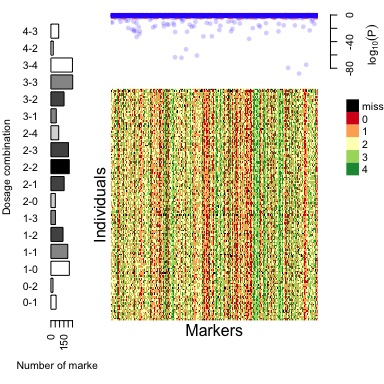
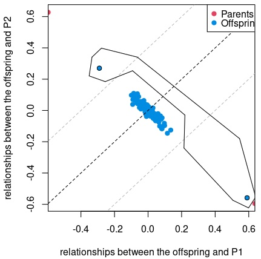
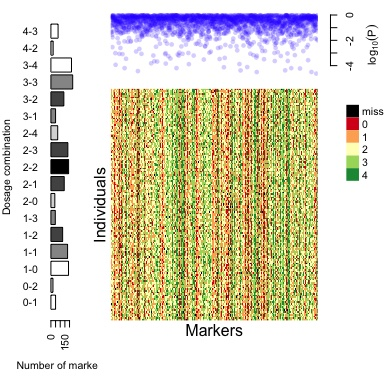
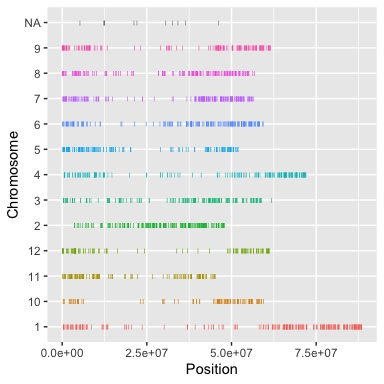
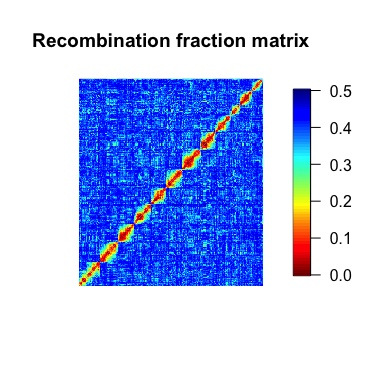
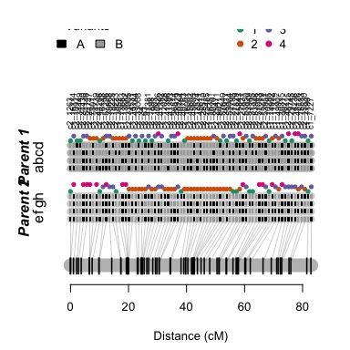
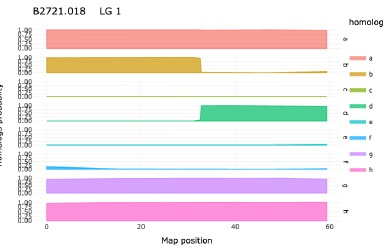

```{r, include = FALSE}
knitr::opts_chunk$set(
  collapse = TRUE,
  comment = "#>",
  fig.width = 4, 
  fig.height= 4,
  eval = FALSE
)
options(rmarkdown.html_vignette.check_title = FALSE)
```

MAPpoly is an R package to construct genetic maps in autopolyploids with even ploidy levels. This quick start guide will present some essential functions to construct a tetraploid potato map. Please refer to MAPpoly's [Reference Manual](https://CRAN.R-project.org/package=mappoly) and the [Extended Tutorial](https://rpubs.com/mmollin/tetra_mappoly_vignette) for a comprehensive description of all functions.

# Reading data set
There are several functions to read discrete and probabilistic dosage-based genotype data sets in MAPpoly. You can read a data set from TXT, CSV, VCF, fitPoly-generated or import it from the R packages polyRAD, polymapR, and updog. The data set distributed along with MAPpoly is a subset of markers from ([Pereira et al., 2021](https://doi.org/10.1101/2020.08.24.265397)) in [CSV format](https://rstudio-pubs-static.s3.amazonaws.com/700481_7d2515dd19834079912a462f1149ff93.html#reading-csv-files). Let us read it into MAPpoly

```{r load_data}
library(mappoly)
file.name <- system.file("extdata/potato_example.csv", package = "mappoly")
dat <- read_geno_csv(file.in = file.name, ploidy = 4)
print(dat, detailed = T)
plot(dat)
```


The output figure shows a bar plot on the left-hand side with the number of markers in each allele dosage combination in $P_1$ and $P_2$, respectively. The upper-right plot contains the $\log_{10}(p-value)$ from $\chi^2$ tests for all markers, considering the expected segregation patterns under Mendelian inheritance.

# Data quality control

Quality control (QC) procedures are fundamental to identify:

 - Individuals from crosses other than $P_1 \times P_2$
 - Individuals and markers exceeding a defined threshold of missing data points
 - Markers with distorted segregation
 - Markers with the same genotypic information (redundant markers). Removed markers are positioned into the final map.
 
 Depending on the data set, these procedures can be conducted in any order. Let us first remove individuals from crosses other than $P_1 \times P_2$. When using the interactive function, the user needs to select a polygon around the individuals to be removed by clicking its vertices and pressing Esc.

```{r, eval=FALSE, filter_ind_donot_eval}
dat <- filter_individuals(dat)
```
 

Now, let us filter out markers and individuals with more than 5% of missing data. You can update the threshold interactively

```{r, filter}
dat <- filter_missing(dat, type = "marker", filter.thres = .05)
dat <- filter_missing(dat, type = "individual", filter.thres = .05)
```

Finally, we can filter out markers with distorted segregation and redundant information. At this point, we do not consider preferential pairing and double reduction.

```{r, filter_seg}
seq.filt <- filter_segregation(dat, chisq.pval.thres = 0.05/dat$n.mrk)
seq.filt <- make_seq_mappoly(seq.filt)
seq.red  <- elim_redundant(seq.filt)
```

After filtering, 1990 markers were left to be mapped. Now, let us create a sequence of ordered markers to proceed with the analysis. You can also plot the data set for a specific sequence of markers

```{r,  make_seq}
seq.init <- make_seq_mappoly(seq.red)
plot(seq.init)
```


and check the distribution of the markers in the reference genome, if the information is available

```{r,  geno_ord}
go <- get_genomic_order(input.seq = seq.init) ## get genomic order of the sequence
plot(go)
```


# Two-point analysis{#tpt}

The two-point analysis calculates the pairwise recombination fraction in a sequence of markers. At this point of the analysis, where we have many markers, we use the function `est_pairwise_rf2`, which has a less detailed output than the original `est_pairwise_rf` (which will be used later) but can handle tens of thousands of markers, even when using a personal computer. Nevertheless, the analysis can take a while depending on the number of markers if few cores are available.

```{r, twopt_show, eval=FALSE}
ncores <- parallel::detectCores() - 1
tpt <- est_pairwise_rf2(seq.init, ncpus = ncores)
m <- rf_list_to_matrix(tpt) ## converts rec. frac. list into a matrix 
sgo <- make_seq_mappoly(go) ## creates a sequence of markers in the genome order
plot(m, ord = sgo, fact = 5) ## plots a rec. frac. matrix using the genome order, averaging neighbor cells in a 5 x 5 grid 
```


# Grouping

We can cluster the markers in linkage groups by using function `group_mappoly`. The function uses the recombination fraction matrix and UPGMA method to group markers. Use the option `comp.mat = TRUE` to compare the linkage-based clustering results with the chromosome information. If your data set does not contain chromosome information, use the option `comp.mat = FALSE`. You also can use the interactive version to change the number of expected groups

```{r, group}
g <- group_mappoly(m, expected.groups = 12, comp.mat = TRUE)
plot(g)
g
```


In the table above, the rows indicate linkage groups obtained using linkage information and, the columns are the chromosomes in the reference genome. Notice the diagonal indicating the concordance between the two sources of information.

# Ordering markers

Markers are ordered within linkage groups. In this tutorial, we will show the step-by-step procedure using Linkage Group 1 (LG1). You can do the same for the remaining linkage groups.

Since we had a good concordance between genome and linkage information, we will use only markers assigned to a particular linkage group using both sources of information. We will do that using `genomic.info = 1` , so the function uses the intersection of the markers assigned using linkage and the chromosome with the highest number of allocated markers. To use only the linkage information, do not use the argument `genomic.info`. You also need the recombination fraction matrix for that group.

```{r, select_group}
s1 <- make_seq_mappoly(g, 1, ## Select LG1 
                       genomic.info = 1) 
m1 <- make_mat_mappoly(m, s1)
```

Let us order the markers in the sequence using the MDS algorithm.
```{r, order_mds}
mds.o1 <- mds_mappoly(input.mat = m1)
s1.mds <- make_seq_mappoly(mds.o1)
plot(m1, ord = s1.mds)
```
Usually, at this point, the user can use diagnostic plots to remove markers that disturb the ordering procedure. We didn't use that procedure in this tutorial, but we encourage the user to check the example in `?mds_mappoly`. Now, let us use the reference genome to order the markers.

You also can order the markers the reference genome
```{r,  order_genome}
gen.o1 <- get_genomic_order(s1)
s1.gen <- make_seq_mappoly(gen.o1)
plot(m1, ord = s1.gen)
```
For the sake of this short tutorial, let us use the MDS order (`s1.mds`) to phase the markers. Still, you can also try the genome order (`s1.gen`) and compare the resulting maps using function `compare_maps`, and you will notice that the genomic order yields a better map since its likelihood is higher.

# Phasing markers and estimating multilocus recombination fractions.

Estimating the genetic map for a given order involves the computation of recombination fraction between adjacent markers and inferring the linkage phase configuration of those markers in both parents. The core function to perform these tasks in `MAPpoly` is `est_rf_hmm_sequential`. This function uses the pairwise [recombination fraction](#tpt) as the first source of information to sequentially position allelic variants in specific parental homologs. The algorithm relies on the likelihood obtained through a hidden Markov model (HMM) for situations where pairwise analysis has limited power. Once all markers are positioned, the final map is reconstructed using the HMM multipoint algorithm. For a detailed description of the `est_rf_hmm_sequential` arguments, please refer to MAPpoly's [Reference Manual](https://CRAN.R-project.org/package=mappoly) and the [Extended Tutorial](https://rstudio-pubs-static.s3.amazonaws.com/700481_7d2515dd19834079912a462f1149ff93.html#estimating-the-map-for-a-given-order). 

First we need to calculate the pairwise recombination fraction for markers in sequence `s1.mds` using `est_pairwise_rf`, which contains the information necessary to the proper working of the phasing algorithm.

```{r, map_lg1, results = FALSE, eval = FALSE}
tpt1 <- est_pairwise_rf(s1.mds, ncpus = ncores)
lg1.map <- est_rf_hmm_sequential(input.seq = s1.mds,
                                start.set = 3,
                                thres.twopt = 10, 
                                thres.hmm = 20,
                                extend.tail = 50,
                                info.tail = TRUE, 
                                twopt = tpt1,
                                sub.map.size.diff.limit = 5, 
                                phase.number.limit = 20,
                                reestimate.single.ph.configuration = TRUE,
                                tol = 10e-3,
                                tol.final = 10e-4)
```

Now, use the functions `print` and `plot` to view the map results:

```{r map_lg1_plot}
print(lg1.map)
plot(lg1.map, mrk.names = TRUE, cex = 0.7)
```


Now let us update the recombination fractions by allowing a global error in the HMM recombination fraction re-estimation. Using this approach, the genetic map's length will be updated by removing spurious recombination events. This procedure can be applied using either the probability distribution provided by the genotype calling software using function `est_full_hmm_with_prior_prob` or assuming a global genotype error like the following example 

```{r map_err_lg1, results='hide'}
lg1.map.up <- est_full_hmm_with_global_error(input.map = lg1.map, error = 0.05, 
                                             verbose = TRUE)
plot(lg1.map.up, mrk.names = TRUE, cex = 0.7)
```


We can also use the ordinary least squares (OLS) method and the weighted MDS followed by fitting a one dimensional principal curve (wMDS_to_1D_pc)

```{r map_reest, results='hide'}
lg1.map.ols <- reest_rf(lg1.map, m1, method = "ols")
lg1.map.mds <- reest_rf(lg1.map, m1, method = "wMDS_to_1D_pc", input.mds = mds.o1)
```

Now let us create a list with the maps and plot the results

```{r map_list,  results='hide'}
map.list.lg1  <- list(orig = lg1.map, 
                      updt = lg1.map.up, 
                      ols = lg1.map.ols, 
                      mds = lg1.map.mds)
plot_map_list(map.list.lg1, col = "ggstyle", title = "Estimation method")
```

# Homolog probability and preferential pairing profile

To use the genetic map in conjunction with QTL analysis software, we need to obtain the homolog probability for all linkage groups for all individuals in the full-sib population. In this short guide, we will proceed only with one linkage group, but this procedure should be applied to all chromosomes in real situations. Let us use the updated map

```{r homolog_p}
g1 <- calc_genoprob_error(lg1.map.up, step = 1, error = 0.05)
to.qtlpoly <- export_qtlpoly(g1) #export to QTLpoly
h1 <- calc_homologprob(g1)
plot(h1, lg = 1, ind = 10)
```


Now let us compute the preferential pairing profile for linkage group 1

```{r, meiosis_evaluation}
p1 = calc_prefpair_profiles(g1)
plot(p1, min.y.prof = 0.25, max.y.prof = 0.4, P1 = "Atlantic", P2 = "B1829.5")
```


# Exporting a phased map

It is possible to export a phased map to an external CSV file using 

```{r, eval=FALSE}
export_map_list(lg1.map.up, file = "output_file.csv")
```

For a script with a complete analysis of the data set presented here, please refer to the [Complete script](https://github.com/mmollina/SCRI/blob/main/docs/tetra/mappoly_intro.md)

# Utility functions

To use the next functions, let us load the complete genetic map

````{r}
in.file <- "https://github.com/mmollina/SCRI/raw/main/docs/tetra/maps_updated.rda"
map_file <- tempfile()
download.file(in.file, map_file)
load(map_file)
````

## Plot genome vs. map
```{r}
plot_genome_vs_map(MAPs.up, same.ch.lg = TRUE)
```


## Map summary
```{r}
summary_maps(MAPs.up)
```
